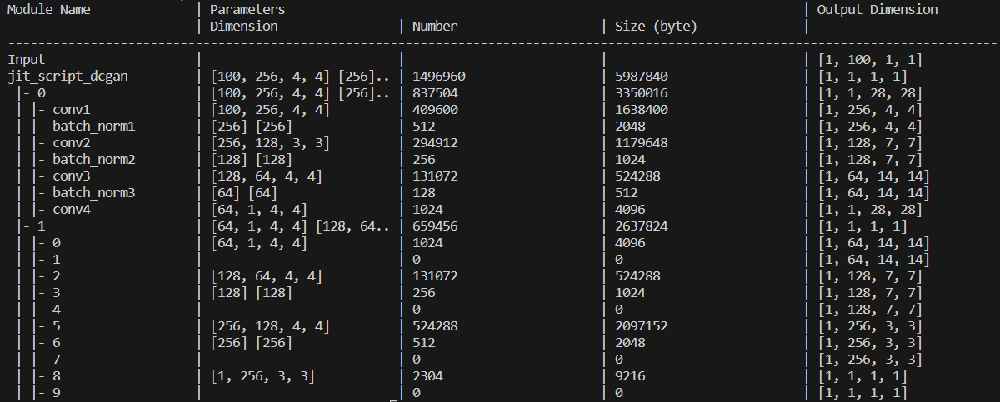

# `libtorch-summary`

libtorch-summary is a C++ library to print libtorch's (aka PyTorch C++ version) model summary in console.

    
    
<em>Example torch-summary table in console.</em>

**Outline**
- [Get Library](#get-library)
- [Example](/example/README.md)
- [Usage](#usage)

## Get Library
Library is available in two channels.
1. [Build from source code](#build-libtorch-summary-library-from-source-code)
2. [Download from release](https://github.com/rapee9999/libtorch-summary/releases)

### Build `libtorch-summary` Library from Source Code
1. Clone this git repo in your preferred directory by running below command. 
    `git clone https://github.com/rapee9999/libtorch-summary.git`
1. Change directory to the repo by running below command. 
    `cd libtorch-summary`
1. Make sure you have C++ compiler (e.g. `gcc`) and `libtorch`, or run prepared docker image as below. 
    `docker-compose up -d` 
    `docker exec -it libtorch-summary-dev bash`
1. Build `libtorch-summary` library.
    - For Linux, **please read note** in `linux-build.sh` file before run following commands. 
    `./linux-build.sh` 
    `cd .build` 
    `make`
    - For Windows, **please read note** in `win-build.bat` file before run following command. 
    `./win-build` 
    After project created, open and build `.build/libtorch-summary.sln` in Visual Studio.
1. If build successfully, you will find shared libary. 
    - For Linux, `libtorch-summary.so` in `lib` folder.
    - For Windows, `libtorch-summary.lib` and `libtorch-summary.dll` (see note in `win-build.bat`).
1. If you run the prepared docker image, you can terminate the container by running below command. 
`docker-compose down`

[See example applications.](./example/README.md)

## Usage
> void summary(std::shared_ptr<torch::jit::Module> module, std::vector<int64_t> inputShape = {}, std::string name = "Total", int cellWidth = 16 )

Print summary of the given model.

**Parameters**
* **module -** Shared pointer to a JIT module.
* **inputShape -** Dimension of input tensor.
* **name -** Model name
* **cellWidth -** Cell width in number of charactors

